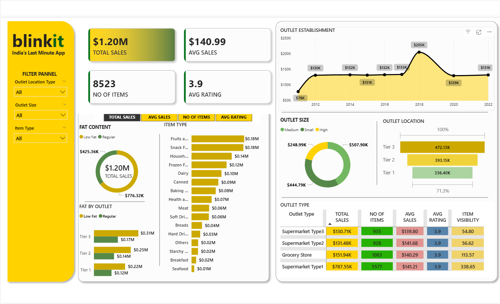

# Blinkit Sales Dashboard 📊

## 📌 Project Overview
This project is a Power BI dashboard created to analyze sales performance data for Blinkit (India’s last-minute delivery app).  
The dashboard provides a clear view of overall sales, item performance, outlet analysis, and customer ratings to support data-driven business decisions.

## 🎯 Objective
- Analyze overall sales performance
- Identify top-performing item categories
- Compare sales across outlet sizes and locations
- Track average sales and customer ratings

## 🛠 Tools & Technologies Used
- Power BI
- Microsoft Excel
- DAX (Data Analysis Expressions)

## 📂 Dataset Information
- Source: Excel dataset (collected from YouTube for practice purposes)
- Rows: 8,524
- Data Type: Retail / Grocery sales data

## 📊 Key Insights from Dashboard
- Total Sales: $1.20M
- Average Sales per Item: $140.99
- Total Number of Items: 8,523
- Average Customer Rating: 3.9
- Tier 3 outlets generate the highest sales
- Medium-sized outlets contribute the maximum revenue
- Fruits & Snacks are among the top-selling item categories

## 🧮 DAX Measures Used
- Total Sales
- Average Sales
- Total Number of Items
- Average Rating
- Category-wise Sales
- Outlet-wise Sales Performance

## 🖼 Dashboard Preview

## 🎯 Target Role
Data Analyst

## 📁 Project Files
- Blinkit_Sales_Dashboard.pbix → Power BI dashboard file
- dashboard.png → Dashboard screenshot
- Dataset.xlsx → Source Excel file (optional)

## 🚀 Conclusion
This dashboard helps stakeholders quickly understand sales trends, outlet performance, and customer preferences, making it useful for business and operational decision-making.
